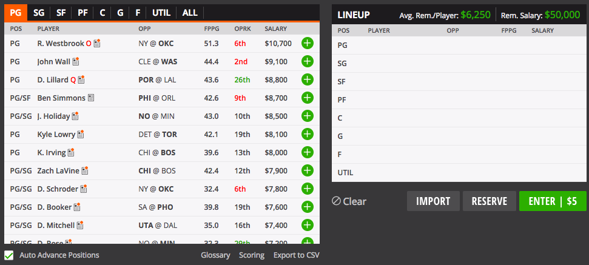
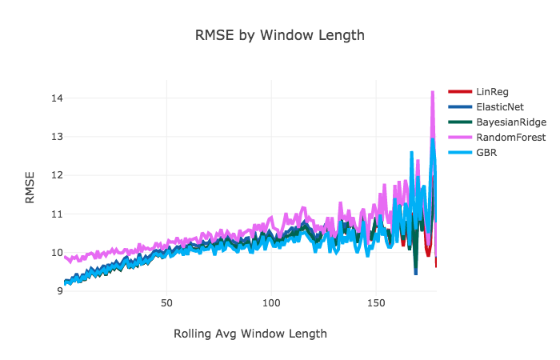

## Finding the Perfect Lineup
* Daily fantasy sports are derived from the season long contests in which contestants draft teams and keep that team for the length of the season.

* In daily fantasy contests, contestants select teams on a daily basis. After the last game has ended, dfs results are posted and winning contestants are paid out.

* When selecting a team, a contestant is constrained by the salary cap (an allotment of draft funds). Each contestant has the same salary cap.

 Figure 1 Draftkings lineup draft sheet 
 source: Draftkings.com

###### Types of Contests (50/50 vs. Tournaments)
1. 50/50: If a contestant's score is in the top 50% of all entries, the contestant wins the cost of the entry price.

      * 50/50 is a safe contest that professional couch potatoes use to build and maintain a bankroll.

2. Tournament: A single contest in which only the top tier wins. Tiers can vary across different types of contests.

      * The tournament strategy differs from safer contests because tournaments can have hundreds to tens of thousands of contestants so you have to find a way to separate yourself from the pack.

## Objectives
* Predict daily fantasy scores for each player using rolling averages of various statistics over the previous n days.

    * Fantasy scores are a weighted value of a player's box score for a given game.

| Scoring       |           |
|---------------|-----------|
| Point         | +1 Pt     |
| Made 3pt Shot | +0.5 Pts  |
| Rebound       | +1.25 Pts |
| Assist        | +1.5 Pts  |
| Steal         | +2 Pts    |
| Block         | +2 Pts    |
| Turnover      | -0.5 Pts  |
| Double Double | +1.5 Pts  |
| Triple Double | +3 Pts    |

Figure 2. Scoring Calculation

* Using those predictions, construct the optimal lineup through an automated process by selecting players to fit within the positional and salary cap constraints.

* Compare the lineup chosen by my model to the actual scores along with other lineups chosen by higher scoring contestants.

* Adjust the features and the models to improve predictive ability.

## Methods
* Combined 3 different datasets from the My Sports Feeds data API to create a singular predictive training dataset consisting of player statistics, team statistics and daily fantasy scores.

* Determined the optimal window size to predict daily player performance, i.e., how many of the previous performances should be used in determining a players performance today?

Figure 3. RMSE By Window Length

* After dropping low scores and applying a grid search to determine the best parameters, RMSE came in at 8.989 for the GB Model.

* The predictions below were generated using a Gradient Boosted model with 10-fold cross validation.

| Lineup             | Position | Predicted | Actual |  Diff |
|--------------------|:--------:|:---------:|:------:|:-----:|
| Jeff Teague        |    PG    |   30.34   |  24.7  |  -5.7 |
| Russell Westbrook  |    PG    |   51.14   |  55.8  |  +4.7 |
| Avery Bradley      |    SG    |    19.6   |  24.4  |  +4.8 |
| Garrett Temple     |    SG    |   17.06   |  15.4  |  -1.7 |
| Stanley Johnson    |    SF    |    20.6   |  10.9  |  -9.7 |
| LeBron James       |    SF    |   51.71   |  54.9  |  +3.2 |
| Bobby Portis       |    PF    |   29.06   |  15.8  | -13.3 |
| Frank Kaminsky     |    PF    |   16.91*  |  4.7*  | -12.2 |
| Karl-Anthony Towns |     C    |   42.93   |  60.4  | +17.5 |
| TOTAL              |          |   264.0   |  262.3 |  -1.7 |

Figure 4. Knapsack Selected Lineup 12/15/18

* Unfortunately, this lineup was not a winner but was fairly accurate in determining overall score.

## Conclusion
* Through the first week of trials, the results are promising. However, in order to win large scale contests, the model needs to be able to exploit favorable team and player matchups to find players with a higher chance for success.

* This model does well at finding players that usually do well but fell short in finding unlikely players at lower costs. This can be remedied with more feature engineering to account for team and opponent statistics.

## Future Work
* Analyze predictions further in order to determine the successes and failures of the results.

* Incorporate probability distributions to select riskier and safer lineups for different types of contests.

*  Automate the process from start to finish using a job scheduling utility in order to receive lineup information on a daily basis for multiple sports.
